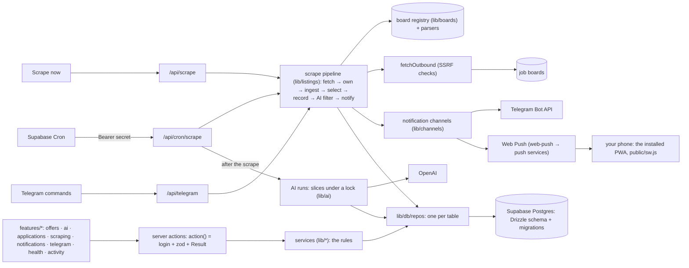
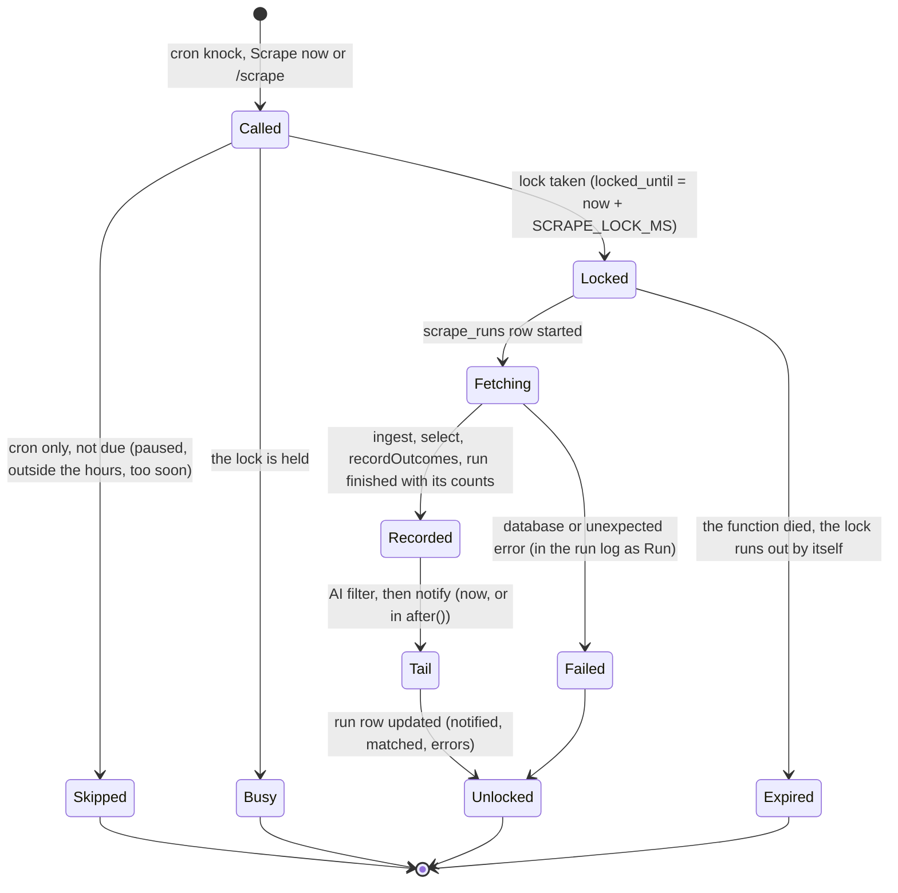
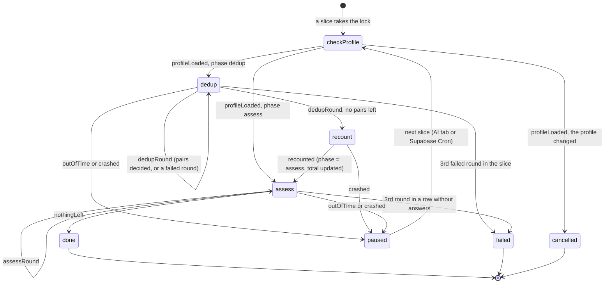
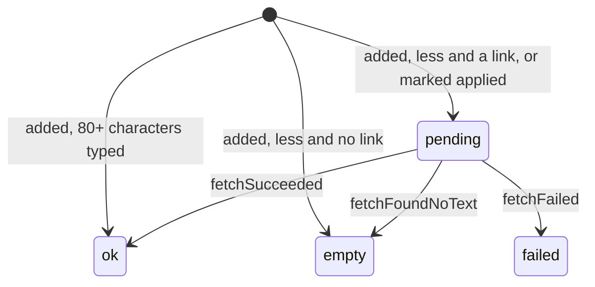

# Architecture

How Jobwatch is put together: what runs when, which code writes which table, the three lifecycles, where
each module lives, and the words the code uses. Running it: [OPERATIONS.md](OPERATIONS.md). Changing it:
[CONTRIBUTING.md](../CONTRIBUTING.md). Why it is built this way: [decisions/](decisions).

## At a glance

Everything runs in one Next.js app on Vercel. There is no queue or worker service: background work runs in
`after()` (after the response, in the same function) and is picked up again by the next trigger when it runs
out of time. Every database access is server-side, through Drizzle over a direct Postgres connection
([ADR 0001](decisions/0001-drizzle-over-postgrest.md)).

## Data flow

### Triggers

| Trigger                              | Route                  | What it does                                                                                                                                                                                                                                                     |
| ------------------------------------ | ---------------------- | ---------------------------------------------------------------------------------------------------------------------------------------------------------------------------------------------------------------------------------------------------------------- |
| Supabase Cron (`pg_cron` + `pg_net`) | `GET /api/cron/scrape` | Checks the secret, then whether a run is due (`checkDue`: not paused, within the hours, the interval passed). Takes the lock, answers 202 at once, runs the scrape in `after()`, then continues waiting AI runs in the time left. `?force=1`, `?wait=1` by hand. |
| "Scrape now" (header, Notifications) | `POST /api/scrape`     | Same-origin and login checks, then a full run whatever the schedule; the AI check and the notifications go on in `after()`.                                                                                                                                      |
| `/scrape` in Telegram                | `POST /api/telegram`   | A full run in `after()`; the bot replies with the counts. The other commands mute, unmute, send the queue and report status.                                                                                                                                     |
| Opening the AI tab / "Check …"       | server render, action  | Starts an AI run, and on every render continues a paused one in `after()`.                                                                                                                                                                                       |
| "Mark applied", "Add", "Fetch again" | server actions         | Save the application, then fetch its ad text in `after()`.                                                                                                                                                                                                       |
| Opening the Applied tab              | server render          | Marks applications with no news for 30 days as ghosted.                                                                                                                                                                                                          |
| Any page, once a minute              | `GET /api/changes`     | `AutoRefresh` compares a fingerprint (last run, newest offer, queue size, lock, mute) and refreshes the page only when it changed.                                                                                                                               |

### The scrape pipeline

`runAll()` in [`lib/listings/run.ts`](../lib/listings/run.ts) puts the steps in
[`lib/listings/pipeline/`](../lib/listings/pipeline) in order, under the scrape lock, with a row in
`scrape_runs`:

1. **`fetchListings`** (`fetch.ts`): every enabled scraper's pages (4 scrapers at once, 20 s per page), through
   `fetchOutbound`, parsed by the scraper's kind ([`lib/listings/registry.ts`](../lib/listings/registry.ts)),
   then filtered: a keyword in the title or skills and a city (or remote), each where the scraper checks it,
   and not an ignored title. A scraper's failure is part of its result, never the run's.
2. **`pickOwners`** (`owners.ts`, pure): the first scraper that found an offer owns it.
3. **`ingest`** (`persist.ts`): `jw_ingest_offers` inserts the offers the database doesn't have and answers with
   them, each with its title key and whether that job was seen before.
4. **`selectAnnouncable`** (`announce.ts`, pure): which new offers are worth a message. Not on a scraper's first
   run (its `mark` is null), not an old offer bumped up (its sort value is at or below the scraper's mark), not
   another board's offer of a known job, not a muted title. One per job.
5. **`recordOutcomes`** (`outcomes.ts` pure, `persist.ts` writes): each scraper's last status, counts and new
   mark; the run's counts go into `scrape_runs`. The announced offers go into `notify_queue` when sending is on
   and a notification channel is ready (Telegram configured, or push configured with a subscribed device).
6. **`aiFilter`** (`ai-filter.ts`): every new job (announced or not) is judged against the active AI profile,
   if the AI filter is on, a profile is usable and `OPENAI_API_KEY` is set. No new batch after `AI_BUDGET_MS`.
7. **`notify`** (`notify.ts`): what waits in the queue goes, as one batch, to every ready
   [channel](#notification-channels): matches listed with their fit, the rest counted. An offer without a
   verdict waits for the next run, and after 20 minutes is sent anyway, marked "not checked". While muted
   nothing is sent (verdicts are still made). An offer no channel delivered goes back into the queue. Also run
   on its own by "Send the … now" in Settings → Notifications and `/send`.

The cron and `/scrape` already run the whole pipeline after their answer, in `after()`. "Scrape now" waits
for steps 1–5 and gets its counts; steps 6 and 7 go on in `after()` (`background`), still under the lock.

### Ads

An offer's full text comes from its board ([`lib/ads/`](../lib/ads)): JustJoin and No Fluff Jobs through
their APIs, Built In and LinkedIn from their pages, the other scraped boards from the page's schema.org
`JobPosting`, any other site from its `<main>`. A text under 80 characters counts as none. Two uses:

- **The AI** (`scrapeOffer`, capped at 8 000 characters) reads it once per offer and caches it in
  `offer_details`; a network error isn't cached, so a later run tries again. A job is judged on its title if
  no offer has a text.
- **Applications** (`scrapeOfferFull`, plus salary, contract, location, work mode, dates) save it in the
  application, trying the job's other boards if the clicked one fails. The state machine is
  [below](#application-ad-content). What the board didn't give (salary, location, remote / hybrid / on-site and
  a hybrid job's office and home days) OpenAI reads from the saved text (`lib/application-details.ts`,
  `details.textRead`); the Applied page reads the texts saved before that, 40 per visit, after it renders.

"Fill in from the link" (Add application) reads the page the same way and lets OpenAI
(`OPENAI_EXTRACT_MODEL`) fill in the form.

### AI runs

A run checks a date range against one profile version ([`lib/ai/runs.ts`](../lib/ai/runs.ts)):

1. **Duplicates** (phase `dedup`): `ai_dup_candidates` proposes pairs of jobs the title key misses (same company
   or one a prefix of the other, similar titles by `pg_trgm`, at most 45 days apart). The AI (low effort)
   decides each pair once (`ai_dup_pairs`); same pairs are merged (`jw_merge_jobs`: `job_links`, and the
   verdicts and application move to the kept job, the earliest).
2. **Assessment** (phase `assess`): each job this profile version hasn't judged, 4 per OpenAI call, 3 calls at
   once, with its ad text. Verdicts are stored per profile version and job, so a second run sends only
   what's new, and editing a profile's text or file (a new version) has its jobs checked again.

The work runs in slices of `SLICE_MS` under the run's lock, each in `after()`
([ADR 0003](decisions/0003-ai-runs-in-after-slices.md)). A slice is started by the AI tab (on every render
while a run is open, and right after "Check") or by Supabase Cron's next call (`continueWaitingRuns`, after the
scrape). The scrape's own AI filter (pipeline step 6) uses the same `assessJobs` without a run.

### Notification channels

[`lib/channels/`](../lib/channels): a `Channel` has a `name`, `ready()` (set up, and someone to send to) and
`send(batch)`, which answers with what it couldn't deliver. `notify` claims the batch from the queue (mute,
the AI check and the 20-minute rule decide what's in it, as before) and `deliver()` hands the same batch to
every ready channel at once; one failing or throwing doesn't stop the others. An offer goes back into the queue
only if no channel got it to you, so a working channel doesn't get it twice
([ADR 0009](decisions/0009-notification-channels-and-push.md)). When no channel delivered, the errors go into the
run log (`AI / Notify`); when one failed and another delivered, it's a warning there (`Notify`: "Sent N; …").

- **Telegram** (`channels/telegram.ts`): the messages below; ready with `TELEGRAM_BOT_TOKEN` and
  `TELEGRAM_CHAT_ID`.
- **Push** (`channels/push.ts`, [`lib/push.ts`](../lib/push.ts)): one notification per batch ("5 new
  offers", the first ones named) to every device in `push_subscriptions`, through `web-push` (encrypted per
  device, signed with the VAPID keys; only to a known push service's https endpoint, through the SSRF guard's address check in production, 10 s
  each). Ready with the three `VAPID_*` variables
  and at least one subscribed device. A device the push service answers 404 / 410 for is removed. Tapping the
  notification opens `/?new=1` (`public/sw.js`).

The PWA side: `app/manifest.ts` (installable, standalone), the icons in `public/icons/` (`scripts/icons.ts`),
and `public/sw.js`, registered on every page by `features/shell/service-worker.tsx`: it shows a push and opens
the app where it points, and caches nothing. Settings → Notifications subscribes this browser
(`features/notifications/`) and saves it with `pushSubscribeAction`, its subscription checked with
`lib/shared/schemas/push.ts`.

### New in the latest run

The lists mark **new** the jobs whose earliest offer (`offers_unique.first_seen`) was first seen during the
latest finished scrape run that brought at least one such job (`runsRepo.latestWithNewJobs()`: its
`started_at`…`finished_at`, the window Activity's `addedPerBoard` counts a run's offers in), compared in SQL to
the microsecond. A run that only added another board's offer of a known job brought no new job, so it isn't the
one. The count line says how many ("3 new in the
last run"), and `?new=1` lists only those, on the offers and the AI tabs alike.

### Telegram

[`lib/telegram.ts`](../lib/telegram.ts) sends through the Bot API (one block per board, five offers per
message, a short pause between messages; what fails to send goes back into the queue). Commands arrive at
`/api/telegram` once the webhook is connected in Settings: Telegram sends back a secret derived from the bot
token, and only `TELEGRAM_CHAT_ID` may give commands. Set-up: [OPERATIONS.md → Telegram](OPERATIONS.md#telegram).

### Cron

Supabase Cron's job (`jobwatch-scrape`) is created by `jw_cron_connect` with the app's URL and secret, and
rescheduled by `jw_cron_reschedule` whenever the interval, hours, time zone or pause change
([`lib/listings/cron.ts`](../lib/listings/cron.ts): the hours turned into UTC for every offset the zone has
in a year, so an hour wider where clocks change). The app still decides whether a run is due. A second job
(`jobwatch-cron-cleanup`) runs daily and keeps a week of `cron.job_run_details`.

### Time zone

The app has one time zone (Settings; `lib/time-zone.ts`): the scraping hours, "today" and the date filters,
every date and time shown, and Telegram's. Only a pick in Settings changes it (and reschedules Supabase Cron);
the browser's zone is only offered. An install from before the setting keeps the zone it last saw from a
browser (`browserTimeZone`); without either, Europe/Warsaw.

## Tables

Declared in [`lib/db/schema.ts`](../lib/db/schema.ts); what Drizzle can't declare (extensions, the view, the
functions, grants, `pg_cron`, seed rows) is in the custom migrations in [`drizzle/`](../drizzle). Queries
live in [`lib/db/repos/`](../lib/db/repos), one file per table; the rules on top of them stay in `lib/`.

| Table                | Holds                                                                         | Written by                                                                                                                                                   |
| -------------------- | ----------------------------------------------------------------------------- | ------------------------------------------------------------------------------------------------------------------------------------------------------------ |
| `offers`             | every board's posting, keyed by `src` + `id`; `dup_key` (title key) generated | `lib/listings/pipeline/persist.ts` (`ingest` → `jw_ingest_offers`)                                                                                           |
| `job_links`          | title keys merged into another job                                            | `lib/ai/merge-duplicates.ts` (`jw_merge_jobs`)                                                                                                               |
| `ai_dup_pairs`       | every pair the AI was asked about, and its answer                             | `lib/ai/merge-duplicates.ts`                                                                                                                                 |
| `applications`       | yours, per job: snapshot, ad text, status, history, note                      | `lib/applications.ts` (mark, add, edit, status, note, ghosting, ad text); `jw_merge_jobs` moves them                                                         |
| `ai_profiles`        | criteria, CV text, version                                                    | `lib/ai/profiles.ts`                                                                                                                                         |
| `ai_verdicts`        | one per profile version and job                                               | `lib/ai/runs.ts` (`assessBatch`); `lib/ai/profiles.ts` drops older versions' on edit; `jw_merge_jobs` moves them                                             |
| `ai_runs`            | manual AI runs: range, phase, progress, lock                                  | `lib/ai/runs.ts` (`startRun`, and each slice writes its state's `save`, `lib/ai/run-state.ts`)                                                               |
| `offer_details`      | an offer's ad text for the AI (`ok` / `empty`)                                | `lib/ai/runs.ts` (`descriptions`)                                                                                                                            |
| `scrapers`           | saved searches, their config, mark and last result                            | `features/scraping/actions.ts` (Settings), `lib/listings/pipeline/persist.ts` (`recordOutcomes`), `lib/db/seed.ts`                                           |
| `scrape_settings`    | one row: schedule, filters, switches, time zone (jsonb)                       | `features/scraping/actions.ts`, `features/notifications/actions.ts`; created by `0003_seed`                                                                  |
| `scrape_state`       | one row: run lock, last call, last run, muted                                 | `lib/listings/run.ts` and `/api/cron/scrape` (lock), `lib/listings/schedule.ts` (last call), `/api/telegram` and `features/notifications/actions.ts` (muted) |
| `scrape_seeds`       | which seeds were added (`board:<id>` markers), so deleted ones stay deleted   | `lib/db/seed.ts`, `0003_seed`, `0004_board_seeds`                                                                                                            |
| `scrape_runs`        | the run log (two weeks)                                                       | `lib/listings/run.ts`                                                                                                                                        |
| `notify_queue`       | new jobs waiting to be sent (every channel)                                   | `lib/listings/run.ts` (enqueue), `lib/listings/pipeline/notify.ts` (claims = deletes; puts back what no channel sent)                                        |
| `push_subscriptions` | the browsers that get push notifications: endpoint, keys, device              | `features/notifications/actions.ts` (enable, disable), `lib/push.ts` (removes one the push service says is gone)                                             |
| `offers_unique`      | view: each job once, its earliest offer, every board's link                   | read-only; defined in `0002_functions`                                                                                                                       |
| `cron.job`           | Supabase Cron's job                                                           | `jw_cron_*` through `lib/db/repos/cron.ts`, from `features/scraping/actions.ts` and `syncCron` (`lib/listings/schedule.ts`)                                  |

RLS is on for every table, with no policies: Supabase's public API can't read anything.

## Lifecycles

### Scrape run

There is no state machine in code: the lifecycle is the lock in `scrape_state` and the row in `scrape_runs`.

A cron call goes on to continue the waiting AI runs in every case (skipped, busy or done). A run whose
function died keeps `finished_at` null: the Health card says it didn't finish.

### AI run

[`lib/ai/run-state.ts`](../lib/ai/run-state.ts): one slice as `transition(state, event)`. The worker takes the
run's lock, does the step its state names, turns what happened into an event and saves the next state's
`save`. Stored, the run is `running` (with its `phase`) until it is `done`, `failed` or `cancelled`; between
slices it is paused (`lock_until` free or expired, `isPaused` in `lib/ai/run-view.ts`).

`startRun` creates the run in `dedup` (or `done` at once when nothing in the range is unjudged), and returns
the open one if this profile version already has one. A job the model skips twice in a slice is left out
and counted in the finished run's note.

### Application ad content

[`lib/ad-content-state.ts`](../lib/ad-content-state.ts): an application's `content`, `content_status`,
`content_error` and `scraped_at`. The services in `lib/applications.ts` turn what happened into an event and
save the next state when it changed; `fetchDue` says when the text is then fetched in `after()`
(`saveContent`).

- **edited**, from any state: 80+ characters → `ok`; a shorter or cleared text → `pending` with a link (the
  ad is fetched), else `empty`; the same text as before → unchanged.
- **"Fetch again"** fetches from any state: `fetchSucceeded` → `ok`, `fetchFoundNoText` → `empty`,
  `fetchFailed` → `failed`. It tries the offer that was marked first, then the job's other boards.

Outside `ok` the text is always what you typed, so a fetch that fails or finds no ad keeps it.

## Module map

| Where                                      | What                                                                                                                                                                                                                                           |
| ------------------------------------------ | ---------------------------------------------------------------------------------------------------------------------------------------------------------------------------------------------------------------------------------------------- |
| [`app/`](../app)                           | Routes only: pages (`/` offers, `/ai`, `/applied`, `/activity`, `/settings`, `/login`), layout, `manifest.ts`, `error.tsx`, `globals.css` (tokens), and `api/` (`application`, `changes`, `cron/scrape`, `health`, `scrape`, `telegram`).      |
| [`public/`](../public)                     | `sw.js` (the service worker: push notifications, no cache) and `icons/` (made by `scripts/icons.ts`); served without the login.                                                                                                                |
| [`features/`](../features)                 | One folder per area, with its components and its `actions.ts`: `offers`, `ai`, `applications`, `scraping`, `notifications`, `telegram`, `health`, `activity`, `login`, `shell` (header, tabs, auto-refresh, service worker).                   |
| [`components/`](../components)             | Pieces more than one feature uses (forms, confirm, date input, time zone, hooks); `components/ui/` holds the shadcn/ui components.                                                                                                             |
| [`server/`](../server)                     | The request's gate: the login cookie (`auth.ts`), `requireLogin()` (`session.ts`), the action wrapper (`action.ts`).                                                                                                                           |
| [`proxy.ts`](../proxy.ts)                  | Every request but the login page, `/api/cron/`, `/api/telegram`, the manifest, the icons and `sw.js` needs the cookie; production without `APP_PASSWORD` answers 503.                                                                          |
| [`lib/boards/`](../lib/boards)             | The board registry: one file per board (hosts, link ids, listing defaults, seeds); `index.ts` lists them.                                                                                                                                      |
| [`lib/listings/`](../lib/listings)         | Scraping: `run.ts` and `pipeline/` (the steps), `parsers/` (one per board, plus generic JSON / HTML / RSS), `registry.ts`, `kinds.ts`, `match.ts` (filters), `settings.ts`, `schedule.ts` (cron secret, `checkDue`), `cron.ts` (the schedule). |
| [`lib/ads/`](../lib/ads)                   | An offer's full ad text and details, one reader per board that needs one.                                                                                                                                                                      |
| [`lib/ai/`](../lib/ai)                     | OpenAI calls (`openai.ts`), profiles, runs and their state machine, the run card's view, merging duplicates.                                                                                                                                   |
| [`lib/db/`](../lib/db)                     | `schema.ts`, `client.ts` (the connection), `connection.ts`, `health.ts` (pending migrations), `seed.ts` (board seeds), `repos/` (one per table).                                                                                               |
| [`lib/health/`](../lib/health)             | The Health card's checks (pure) and the reads they need.                                                                                                                                                                                       |
| [`lib/shared/`](../lib/shared)             | What client components may import: `Result`, errors, formatting, URL filters, `cn()`, the Zod schemas (`schemas/`).                                                                                                                            |
| [`lib/channels/`](../lib/channels)         | The notification channels (Telegram, push) and `deliver()`, which hands each the batch.                                                                                                                                                        |
| `lib/*.ts`                                 | Services and helpers: `applications.ts`, `ad-content-state.ts`, `stages.ts`, `jobs.ts`, `dates.ts`, `time-zone.ts`, `telegram.ts`, `push.ts`, `changes.ts`, `budgets.ts`, `env.ts`, `log.ts`, `outbound.ts`, `dom.ts`, `hmac.ts`.              |
| [`drizzle/`](../drizzle)                   | The migrations (written by `npm run db:generate`, custom ones by hand) and drizzle-kit's snapshots.                                                                                                                                            |
| [`scripts/`](../scripts)                   | `db-migrate.ts` (`npm run db:migrate`), `db-preflight.sql`, `db-verify-migrations.sh`, `test-db.sh`, `db-reset-local.sh`, `lib-local-db.sh` (the localhost guard), `icons.ts` (the app's icons).                                               |
| [`test/`](../test)                         | Vitest: unit tests mirroring the source tree, `test/db/` against a real database, `test/fixtures/` (recorded board pages).                                                                                                                     |
| [`supabase/scripts/`](../supabase/scripts) | `remove-duplicates.sql`, a one-off cleanup from before the app de-duplicated jobs; kept for reference, not to be run.                                                                                                                          |

## Glossary

The words Jobwatch uses for its things, and what each one means in the code. One word per idea: a code
identifier uses the word below, never a synonym. Where the database or a stored format still spells it the old
way, the entry says so (_stored as_): those names stay (production data and applied migrations), and
`lib/db/schema.ts` maps them to the word used in TypeScript.

### The domain

- **board**: A job site: JustJoin, No Fluff Jobs, LinkedIn… Built-in boards are in `lib/boards/`; a generic
  scraper's site is a board too, under the id you give it. In code, `board` is a board's id (a string) or its
  registry entry (`Board`).
- **`src`**: The field that stores a board's id on a record, and the URL's board filter. A name for that field
  (or a value read straight from it), not for a board in general.
  _Stored as:_ `offers.src`, `applications.src`, `scrapers.src`, the `?src=` URL filter, `src` in
  `offers_unique.copies`.
- **scraper**: One saved search on a board: its link, its filters and how its last run went.
  _Stored as:_ `scrapers`.
- **kind**: Which parser reads a scraper's pages: a board's own (`justjoin`, `linkedin`…) or a generic one
  (`json`, `html`, `rss`). _Stored as:_ `scrapers.kind`.
- **mark**: A scraper's newest sort value seen; an offer at or below it is saved but not announced. Null until
  the scraper's first run, which only saves. _Stored as:_ `scrapers.mark`.
- **offer**: One posting on one board: a row in `offers`, identified by `src` + `id`. `OfferLink` is an
  offer's board, id and link. _Stored as:_ `offers`; a job's offers are `offers_unique.copies`.
- **job**: The same position across boards: every offer with the same title key, plus the ones the AI merged
  into it. The offer lists show jobs (`ListedJob`), each once, with its earliest offer and every board's link.
  _Stored as:_ `offers_unique` (one row per job).
- **title key** (`titleKey`): An offer's company (without legal suffix) + title (without gender tags),
  normalised: the database computes it. Offers with the same title key are one job.
  _Stored as:_ `offers.dup_key` (generated by `jw_dup_key`), `job_links.dup_key`.
- **job id** (`jobId`): Which job something belongs to. A job's id is one of its title keys: its own, or, after
  an AI merge, the kept job's. An application, a verdict and a queued notification point at a job by its id.
  _Stored as:_ `offers_unique.dup_key`, `job_links.job_key`, `applications.dup_key`, `ai_verdicts.dup_key`,
  `notify_queue.dup_key`, `ai_dup_pairs.key_a`/`key_b`.
- **first seen**: When a scraper first saw an offer; "newest" everywhere means this
  ([ADR 0002](decisions/0002-newest-by-first-seen.md)). _Stored as:_ `offers.first_seen`.
- **new**: A job first seen in the latest finished scrape run that brought new jobs: marked in the lists, listed by
  `?new=1` (`isNew`, `latestWithNewJobs`). Not a stored flag.
- **channel**: Where new offers are sent: Telegram or push (`lib/channels/`, `Channel`). A **device** is one
  browser subscribed to push. _Stored as:_ `push_subscriptions`.
- **merge**: The AI deciding two jobs are one (`lib/ai/merge-duplicates.ts`): the later one's title keys then
  point at the kept job's id (`job_links`), and its verdicts and application follow. Not to be confused with
  `supabase/scripts/remove-duplicates.sql`, a one-off cleanup of duplicate rows.
  _Stored as:_ `job_links`, `ai_dup_pairs`, `jw_merge_jobs`.
- **application**: Yours, per job: you applied to it. Keeps a snapshot of the ad (title, company, link, the
  full text), its status, its history and your note. _Stored as:_ `applications`, keyed by the job id.
- **stage**: How far an application got: submitted, initial contact, screening, technical, HR, offer
  (`STAGES`). _Stored as:_ `applications.stage`.
- **outcome**: How the current stage went: in progress, passed, rejected, ghosted, talent pool (`OUTCOMES`).
  The offer stage names them received / accepted / rejected.
  _Stored as:_ `applications.stage_state`; `state` in each history entry (jsonb).
- **status**: An application's stage + outcome together (the history is the list of its statuses). Elsewhere,
  a record's stored lifecycle value: an AI run's `status`, an ad text's `contentStatus`, a scraper's
  `lastStatus`.
- **ghosted**: No news for 30 days since the last change: the application's outcome becomes ghosted by itself
  (`GHOST_AFTER_DAYS`), marked "(auto)" in its history.
- **profile**: What the AI judges jobs against: a prompt and, optionally, your CV as text. The most recently
  used one is active. _Stored as:_ `ai_profiles`.
- **version**: A profile's version number, bumped when its prompt or file changes. Verdicts belong to one
  profile version. _Stored as:_ `ai_profiles.version`, `ai_verdicts.version`, `ai_runs.version`.
- **verdict**: The AI's judgement of one job for one profile version: match or not, a score, a summary and the
  checks behind it. _Stored as:_ `ai_verdicts`.
- **run**: Say which. A _scrape run_ is one pass over the enabled scrapers (`scrape_runs`,
  `lib/listings/run.ts`, `ScrapeRun`). An _AI run_ is a manual "check this date range" (`ai_runs`,
  `lib/ai/runs.ts`, `AiRun`): a duplicate check (merges; the `dedup` phase), then the verdicts (`assess`), in
  slices. The UI calls the two steps _Duplicates_ → _Assessment_ (`lib/ai/run-view.ts`). Inside a module that
  only has one, `run` is enough. _Stored as:_ `scrape_runs`, `ai_runs`.
- **slice**: One stretch of an AI run's work, in one function's `after()`, under the run's lock.
- **trigger**: What started a scrape run: `cron`, `manual` ("Scrape now") or `telegram`.
  _Stored as:_ `scrape_runs.trigger`.
- **ad**: An offer's full text and details as its board's page shows it (`lib/ads/`). Fetched once per offer
  for the AI (`offer_details`), and for an application into the application itself.
  _Stored as:_ `offer_details`, `applications.content`.

### Words with one meaning in code

- **key**: only in its plain JavaScript sense (a `Map` key, a React `key`, an object key, the `localStorage`
  key of a note draft). It never names a job or an offer: that is `titleKey` or `jobId`. `offerKey()` is the
  `Map` key of an offer (`src` + `id`); `companyKey` is the title key's company part.
- **state**: a state machine's state (`lib/ad-content-state.ts`, `lib/ai/run-state.ts`), the scraping machine
  state (`scrape_state`: lock, last call, muted) or React state. Not an outcome, except as the stored name in an
  application's history (`HistoryEntry.state`, kept because it's in the database's jsonb).
- **status**: see above. A stored, user-facing lifecycle value; `state` is the machinery.
- **copy**: not a domain word. One board's posting of a job is an _offer_; "copy" only means a copy (of a URL,
  an object). The view's `copies` column is mapped to `offers` in TypeScript.
- **source**: not a domain word. What the filter chips show are boards (`BoardOption`, `boardOptions()`); the
  view's `sources` column (every board of a job) is mapped to `boards`. The UI says "board" (a scraper's
  "Board id" is its `src`).
- **z**: only Zod's `z`. A time zone's helpers are a `zone` (made by `zoneOf(tz)`); `tz` is a zone's name.

### Kept on the wire

Values that live outside the code keep their names, so nothing breaks across a deploy:

- the database's columns and SQL functions (`dup_key`, `job_key`, `stage_state`, `key_a`/`key_b`, `copies`,
  `sources`, `jw_dup_key`…), mapped in `lib/db/schema.ts`;
- an application's history entries (`{ stage, state, at, auto }`, jsonb);
- note drafts in the browser: `localStorage` key `jobwatch:note:<job id>`, value `{ text, base }`;
- the URL's filters (`?q=`, `?src=`, `?days=`…);
- `/api/application` takes `?jobId=`, and still `?key=` from pages loaded before the rename. That only keeps
  their ad text loading: the server actions take the new field names (`jobId`, `outcome`) with no alias, so a
  tab opened before the deploy needs a reload (its unsaved note stays in `localStorage` meanwhile);
- what the prompts send OpenAI and read back (a job's `board`, `first_seen`; a pair's `p`; an offer's `n`).
